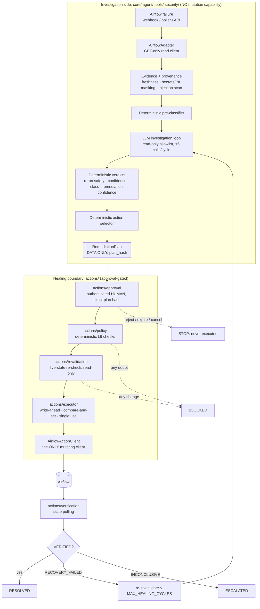
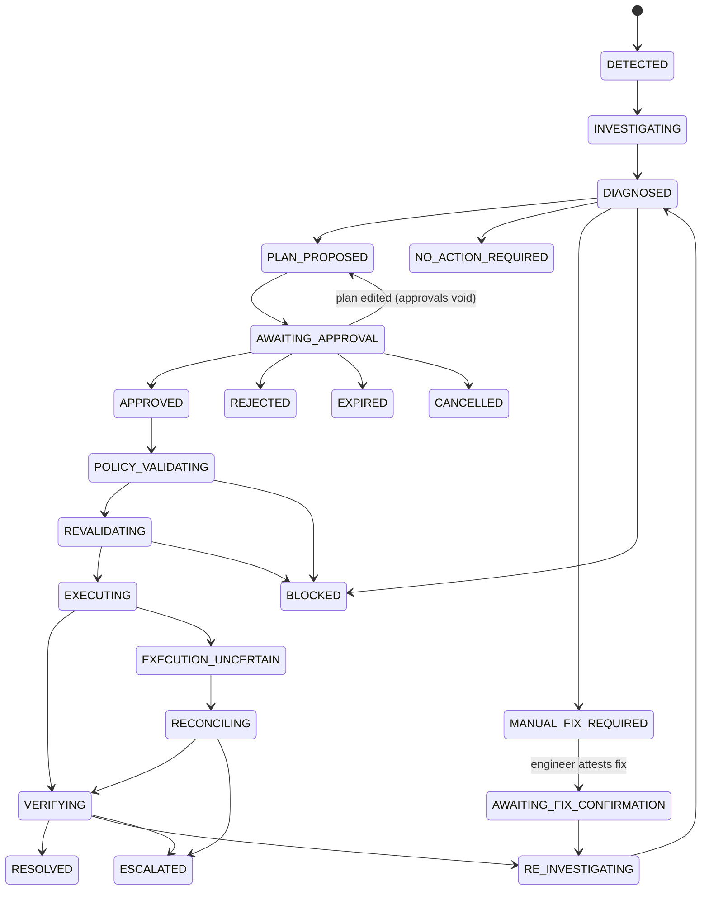
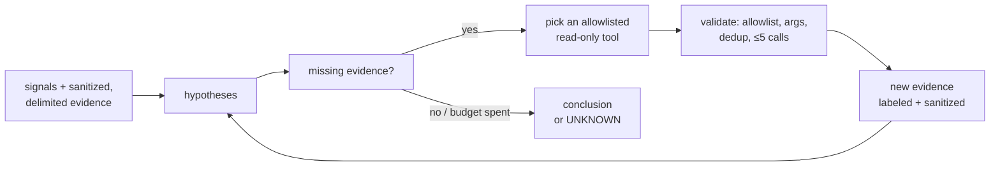

# Universal Pipeline Failure Triage & Human-Approved Self-Healing Agent

> The V1 agent monitors Airflow pipeline failures, investigates them using evidence from logs, execution history, state and other available sources, determines the root cause and rerun safety, and proposes a remediation. An authenticated engineer must explicitly approve the exact remediation plan before the system can execute it. The agent then performs the approved Airflow recovery, verifies the result, and either resolves the incident or escalates it for further investigation. It does not blindly retry pipelines, and it does not let an LLM directly control production: it investigates first, proves what it can, gets human approval for the exact action, re-checks live state, executes within policy, and verifies the outcome.

Evidence-driven · human-controlled · security-conscious · auditable · deterministic where safety matters · LLM-assisted, not LLM-controlled.

**Status (honest):** V1 MVP. Everything below runs in **DEMO MODE** against an in-process **FAKE AIRFLOW (DEMO)** with a scripted **MOCK LLM**. The Airflow read and action clients follow the Airflow 2.10.5 OpenAPI spec, but **they have not been run against a real Airflow**. The optional [live-test kit](#first-live-test-procedure) is the next step for that. `AnthropicProvider` has been tested only against a stub client.

---

## Contents
- **Introduction:** [Problem](#problem) · [Architecture](#architecture)
- **How investigation works:** [Why adapters](#why-adapters) · [Capability discovery](#capability-discovery) · [Evidence model and provenance](#evidence-model-and-provenance) · [Failure taxonomy](#failure-taxonomy) · [Hypothesis loop](#hypothesis-loop) · [State abstraction](#state-abstraction) · [Rerun safety](#rerun-safety)
- **How healing works:** [Remediation classes](#remediation-classes-and-eligibility) · [Action selection](#deterministic-action-selection) · [Recovery scope](#recovery-scope) · [Remediation confidence](#remediation-confidence) · [Approval](#approval-workflow-and-auth-providers) · [Policy and live re-validation](#policy-and-live-re-validation) · [Executor](#executor-write-ahead-and-idempotency) · [Verification](#verification-and-its-limits-state-only) · [Re-investigation](#re-investigation-and-cycle-limit) · [Kill switches](#kill-switches-and-modes)
- **Security and Airflow setup:** [Security model](#security-model) · [Airflow least-privilege roles](#airflow-least-privilege-roles) · [First live test](#first-live-test-procedure) · [Generic onboarding](#generic-platform-onboarding)
- **Using it:** [API](#api) · [UI](#ui) · [Demos (hero step by step)](#demos) · [Evaluation](#evaluation)
- **Setup:** [Installation](#installation) · [Environment variables](#environment-variables) · [Running locally](#running-locally) · [Running tests](#running-tests)
- **Extending and status:** [Adding a new platform](#adding-a-new-platform) · [Limitations](#limitations) · [Roadmap](#roadmap)

---

## Problem

When a pipeline fails at 3 a.m., the usual responses are both bad:
- **A blind retry.** It may double-write a non-idempotent load, run against a schema that is still broken, or collide with a run that is still active.
- **A human digging through logs.** This is slow, and when the answer turns out to be "it was transient, retry it", the recovery is often clicked through without checking whether a retry is safe.

The task is to establish:
- what actually failed, separating the primary failure from its downstream symptoms;
- why it failed, backed by evidence and not a guess;
- whether a rerun is safe, given how the task writes and what state it keeps;
- whether the cause has cleared.

Only then should a human approve the *exact* recovery. The system must also check that the world hasn't changed before acting, and verify the result afterwards.

## Architecture

### Investigation vs healing: the trust boundary

The AI may investigate autonomously. It may **not** execute remediation without explicit human approval. The LLM can create *data describing* an action; it never has the *capability* to perform one.



Import boundaries are enforced by AST tests in `tests/architecture/`:
- `core/`, `agent/`, `tools/` and `security/` never import `actions/`, platform adapters or platform SDKs.
- Only `actions/airflow_actions.py` speaks Airflow HTTP among the actions modules.
- Only `api/` imports `actions.executor`.
- `AirflowActionClient` is constructed only inside `actions/`.
- The UI is a pure HTTP client.
- `core` contains no `platform == "airflow"` branch.

### End-to-end flow and the incident lifecycle



The transition table in `core/remediation/state_machine.py` is the single authority: illegal transitions raise, and every transition writes a hash-chained audit event. REJECTED, EXPIRED, CANCELLED and BLOCKED are terminal for their plan and never lead to execution.

### Project layout

| Path | Contents |
|---|---|
| `core/` | Models, evidence, taxonomy, reasoning, safety, remediation logic and the adapter registry. Data and logic only. |
| `adapters/` | `base/` holds the interfaces; `airflow/` is the GET-only read side; `generic/` is manual evidence. |
| `tools/` | The 17 read-only investigation tools plus their registry. |
| `security/` | SQL policy, PII, secrets, prompt injection, auth providers. |
| `agent/` | Triage agent, investigation loop, planner (rationale only), prompts, LLM providers. |
| `actions/` | The approval-gated healing boundary: registry, approval, policy, revalidation, executor, verification, `airflow_actions.py`. |
| `api/` | FastAPI routes, webhooks, orchestrator, container, poller, CLI. |
| `database/` | SQLAlchemy models and repository (SQLite). |
| `notifications/` | Console, Slack and email notifiers. |
| `frontend/` | Streamlit UI (HTTP client only). |
| `evaluation/` | Part R scenario catalog, harness, evaluator. |
| `demo/` | `fake_airflow/` (FAKE AIRFLOW (DEMO)), `scenarios/`, `airflow_callback/`, `live_test/`. |
| `tests/` | `unit/`, `integration/`, `security/`, `architecture/`, `remediation/`, `eval/`, `contract/`. |

## Why adapters

Airflow is the only real integration in V1, but the investigation engine is platform-independent:
- **`PipelineAdapter` (read-only).** It normalizes failures into a universal `PipelineFailureEvent`, declares its read capabilities, and answers read requests. Every read method defaults to `UNAVAILABLE`, so an adapter implements only what its platform supports and nothing is fabricated.
- **`RemediationExecutor` (mutating).** It declares action capabilities and performs a plan's enumerated action. Executors live only in `actions/`. A platform without one, such as Generic or the test-only ExamplePlatform, gets `healing = NOT_APPLICABLE`.

`tests/architecture/test_platform_independence.py` runs the ExamplePlatform fake and asserts that the checksums of `core/` and `agent/` are unchanged, and that neither references it.

## Capability discovery

Read capabilities are declared by the adapter; the LLM's tool allowlist is **tool registry ∩ adapter capabilities**. Action capabilities are declared by the executor. Unsupported tools are recorded as `UNAVAILABLE` and never called.

| Capability | Airflow (V1) | Generic | Notes |
|---|---|---|---|
| run_logs, run_history, configuration, upstream_status, downstream_status | ✅ | run_logs, run_history, configuration (uploaded) | Airflow exposes orchestration metadata only |
| schema, row_counts, data_quality | ❌ | ✅ (uploaded) | |
| lineage, state_tracking, transaction_history, code_changes, infrastructure_events, permissions | ❌ | ❌ | `UNAVAILABLE`; this caps confidence where a rival hypothesis is untestable |
| Actions: retry_failed_task, retry_failed_dag_run | ✅ (with write credentials) | ❌ healing NOT_APPLICABLE | |

`GET /capabilities/{pipeline_id}` shows the matrix for a pipeline.

## Evidence model and provenance

Every `EvidenceItem` carries its id, category, source, platform, timestamp, `execution_id`, attempt, value, raw and normalized signal, reliability, sensitivity, a `temporal_label` (`CURRENT | HISTORICAL | STALE | MISMATCHED`), and **provenance** `{adapter, capability, tool, source, collected_at, investigation_cycle}`.

Ground rules:
- Only collected signals are evidence. LLM output, hypotheses and recommendations never are.
- FACT and INFERENCE claims must cite evidence ids, and the grounding validator blocks a `COMPLETE` report otherwise.
- **Freshness:** STALE, mismatched execution, mismatched attempt and unrelated runs are detected. Mismatched evidence never influences confidence. Earlier attempts and earlier investigation cycles are labeled HISTORICAL.
- **Size limits:** huge logs are reduced to the error region, the stack trace and matching signatures, bounded by `MAX_LOG_BYTES` and `MAX_EVIDENCE_BYTES`, with a reference to the original kept.
- **Masking:** secrets are scrubbed and PII masked (with stable placeholders such as `<EMAIL_1>`) before anything is stored or sent to the LLM.

## Failure taxonomy

There are 14 top-level categories:

| Category | Example subcategories |
|---|---|
| SOURCE_SCHEMA_DRIFT | column_missing, column_renamed, type_changed |
| DATA_QUALITY | rule_violation, null_spike, duplicate_keys |
| VOLUME_ANOMALY | row_count_drop, empty_source |
| CODE_LOGIC_BUG | recent_change, unhandled_case |
| INFRASTRUCTURE | node_loss, cluster_terminated, disk_full |
| ORCHESTRATION_STATE | stuck_state, scheduler_issue |
| UPSTREAM_DEPENDENCY | upstream_failed, source_unavailable |
| CONFIGURATION | missing_object, bad_connection_config |
| SECURITY_AUTHORIZATION | permission_denied, expired_credential |
| NETWORK_CONNECTIVITY | connection_refused, dns, timeout_network |
| RESOURCE_QUOTA | memory, quota_exceeded, throttling |
| CONCURRENCY | overlapping_run, lock_contention |
| TRANSIENT_RECOVERED | succeeded_on_retry |
| OTHER_UNKNOWN | (always valid) |

A deterministic **pre-classifier** maps raw text to a normalized signal (for example, "connection reset" becomes `NETWORK_CONNECTIVITY_FAILURE`). It also produces candidate categories and the evidence that would distinguish between them. It never decides the root cause.

## Hypothesis loop



**Initial collection.** These steps don't count against the budget: logs, run history, task state, pipeline state, plus follow-up collection driven by the pre-classifier.

**The LLM's turns.** The LLM then gets up to **5 investigative tool calls per cycle**. Repeated requests are deduplicated. A tool off the allowlist, an argument trying to target another pipeline, or malformed output is rejected without running. Each step is recorded as **Hypothesis → Tool → Evidence → Decision**. If evidence is insufficient, the root cause is `UNKNOWN`.

**Deterministic overrides.** Code overrides the LLM on rerun safety, confidence (the LLM can only lower it), remediation class and remediation confidence, primary-vs-symptom analysis, transient detection, and every executable field of a plan.

## State abstraction

State is an abstract mechanism: `watermark`, `checkpoint`, `batch_id`, `kafka_offset`, `delta_version`, `cursor`, `transaction_id`, `control_table`, `partition_state`, `job_state`, `none` or `unknown`.

`StateEvidence.status` has five values that are always kept distinct: `NOT_APPLICABLE`, `UNAVAILABLE`, `UNKNOWN`, `AVAILABLE_BUT_UNCHANGED`, `AVAILABLE_AND_CHANGED`. UNAVAILABLE or UNKNOWN is never converted into "unchanged".

**No watermark is assumed.** If the mechanism is unknown and safety can't be proven, rerun safety is `UNKNOWN`.

## Rerun safety

Rerun safety is deterministic; the LLM never decides it. Every rule is evaluated and recorded in `rerun_safety_rule_trace`, and the most conservative result wins: **UNSAFE > UNKNOWN > SAFE_WITH_CONDITIONS > SAFE**.

| Rule | Condition | Outcome |
|---|---|---|
| R1 | COMMITTED and non-idempotent or idempotency unknown | UNSAFE |
| R2 | COMMITTED and idempotent | SAFE_WITH_CONDITIONS |
| R3 | PARTIAL_CONFIRMED and non-idempotent | UNSAFE |
| R4 | PARTIAL_CONFIRMED and idempotent | SAFE_WITH_CONDITIONS |
| R5 | PARTIAL_POSSIBLE: non-idempotent gives UNSAFE; idempotency unknown gives UNKNOWN | as stated |
| R6 | OVERLAP_CONFIRMED: non-idempotent gives UNSAFE, otherwise UNKNOWN | as stated |
| R7 | Concurrency UNKNOWN | caps at SAFE_WITH_CONDITIONS when planning; at execution time it must be resolved, or the plan is BLOCKED |
| R8 | Target write UNKNOWN | UNKNOWN |
| R9 | The applicable state mechanism is UNAVAILABLE or UNKNOWN | UNKNOWN |
| R10 | Mechanism unknown and write safety not otherwise proven | UNKNOWN |
| R11 | DQ gate failed PRE_WRITE and retry supported | SAFE_WITH_CONDITIONS |
| R12 | NONE_CONFIRMED write, idempotent, state unchanged or NOT_APPLICABLE | SAFE |
| R13 | No rule matched | UNKNOWN |

**Where the inputs come from:**
- **Task policy:** the `TaskExecutionPolicy` supplied when the pipeline is registered.
- **Concurrency:** active runs read from Airflow.
- **Target write and failure stage:** Airflow cannot report whether a task wrote to its target. A pipeline may opt in by logging one strict line, `[triage] target_write=none_confirmed failure_stage=pre_write`. It is accepted only from the failed attempt's own CURRENT, HIGH-reliability log. Without it, the target write is UNKNOWN, rule R8 gives UNKNOWN, and the plan is BLOCKED.

For a DAG-run plan, safety is computed for every primary failure and the most conservative result applies.

## Remediation classes and eligibility

| Failure | V1 result |
|---|---|
| Transient task failure, task stuck or scheduler issue, network / transient infra / throttling, upstream now succeeded; each with cause cleared | AUTOMATABLE, retried after approval |
| Concurrency: overlapping run finished | AUTOMATABLE (BLOCKED while the run is still active) |
| Transient recovered (attempt 2 succeeded) | NO_ACTION_REQUIRED (never "retry again") |
| DQ gate worked as designed (no corruption, bad records quarantined) | NO_ACTION_REQUIRED |
| Schema drift, code bug, configuration, permission, data corruption, volume anomaly | MANUAL_FIX_REQUIRED |
| Unknown failure | MANUAL_FIX_REQUIRED (no plan) |
| Automatable category but rerun safety UNSAFE / UNKNOWN | BLOCKED (no override in V1) |
| Automatable category but remediation confidence LOW | MANUAL_FIX_REQUIRED |

**Cause-cleared evidence is required for AUTOMATABLE.** It must be a CURRENT item, collected after the failure, that speaks to this category. Examples:
- for network causes, a later success in the same Airflow pool;
- for concurrency, the overlapping run reaching a terminal state.

Items can declare which categories they speak to, so a pool success never counts as evidence for CONCURRENCY. An engineer's fix attestation counts only for manual-fix categories (see [Re-investigation](#re-investigation-and-cycle-limit)).

## Deterministic action selection

`core/remediation/selector.py` computes the primary failed task instances in the incident's run. Cascade symptoms are `upstream_failed` tasks whose upstream chain leads to a primary failure.

| Case | Action, scope | `task_instances_to_clear` |
|---|---|---|
| Exactly one primary failure | RETRY_FAILED_TASK, FAILED_TASK | the primary plus its downstream failed/upstream_failed instances |
| Two or more independent primary failures | RETRY_FAILED_DAG_RUN, FAILED_DAG_RUN | every failed/upstream_failed instance in the run |
| Run not failed, any state unreadable, or symptoms that can't be explained | no plan (BLOCKED) | (none) |

Tasks in `success` are never in the list. An action identical to one that already failed in this incident is not proposed again unless new CURRENT evidence supports it.

The LLM **planner** receives this selection as data. It writes only the rationale, the expected effect and the wording of conditions, and it may only recommend lowering the plan to manual. Output that tries to change the action, scope, target, parameters or task list is rejected by a strict schema.

## Recovery scope

V1 has exactly two actions:

| Action | Scope | Airflow operation | Default risk |
|---|---|---|---|
| RETRY_FAILED_TASK | FAILED_TASK | Clear the enumerated failed task instance(s) in the existing DAG run | MEDIUM |
| RETRY_FAILED_DAG_RUN | FAILED_DAG_RUN | Clear the enumerated failed instances of the existing failed run | MEDIUM |

**How the Airflow call is made.** Both actions map to `POST /api/v1/dags/{dag_id}/clearTaskInstances`, the 2.10.5 `post_clear_task_instances` operation, sent with:
- `only_failed=true` and `reset_dag_runs=true`;
- every upstream, downstream, future and past expansion flag set to `false`;
- `dry_run` always explicit, because **Airflow defaults it to true**.

Neither action creates a new run.

**Mapped tasks.** The API's `task_ids` field can't target a single `map_index`. In LIVE mode the executor therefore first requests Airflow's own dry-run listing, and clears only if that listing equals the approved set.

**Risk.** Risk is LOW for non-production FAILED_TASK and HIGH for production FAILED_DAG_RUN. HIGH needs `HIGH_RISK_APPROVALS` (default 2) distinct approvers.

**Things that don't exist anywhere in the codebase** (a test checks this): triggering a new run, pausing or unpausing, marking success or failed, deleting runs, writing Variables, Connections or XCom, running SQL or DML, Git operations, editing watermarks, acting on another DAG, and shell execution.

## Remediation confidence

Remediation confidence is separate from diagnostic confidence, and the LLM can only lower it.

| Level | Requires |
|---|---|
| **HIGH** | Diagnostic HIGH; rerun safety SAFE; a HIGH-reliability CURRENT cause-cleared item; the same action has not failed before in this incident; no unavailable capability that could have tested whether the cause cleared |
| **MEDIUM** | Diagnostic at least MEDIUM; rerun safety SAFE or SAFE_WITH_CONDITIONS; cause-cleared evidence of MEDIUM reliability or better; the same action has not failed before |
| **LOW** | Anything else. LOW means MANUAL_FIX_REQUIRED and never yields an executable plan. |

Reports and the UI show root-cause confidence, remediation confidence and rerun safety side by side.

## Approval workflow and auth providers

```mermaid
sequenceDiagram
    actor Eng as Engineer (HUMAN, APPROVER)
    participant UI
    participant API
    participant Appr as actions/approval
    participant Exec as actions/executor
    Eng->>UI: review plan (hash, tasks, risk, conditions)
    UI->>API: POST /remediation/{id}/approve {plan_version, displayed_plan_hash, conditions_acknowledged}
    API->>API: authenticate (bearer token / demo header); identity never from body
    API->>Appr: approve(principal, body)
    Appr->>Appr: HUMAN? role? listed approver? unexpired?<br/>server recomputes hash; 409 if the view is stale<br/>all conditions acknowledged? distinct approvers?
    Appr-->>API: ApprovalRecord (server hash, single-use)
    API-->>UI: 200 (execution scheduled when approvals are complete)
    API->>Exec: execute_approved (background task)
```

**Auth providers.** Both implement `AuthProvider.authenticate(request) -> Principal | None` and `lookup(principal_id)`:
- **DemoAuthProvider:** fixed demo principals selected with the `X-Demo-Principal` header. It is refused at startup when `HEALING_EXECUTION_MODE=LIVE` or `DEMO_MODE=false`.
- **TokenAuthProvider:** bearer tokens stored only as SHA-256 hashes in the database. Manage them with the CLI: `python -m api.cli create-principal | list-principals | set-roles | disable-principal`. An OIDC provider can be added later without touching approval code.

**Roles:**
- **VIEWER:** reads.
- **ENGINEER:** triage, feedback, fix attestation, manual close.
- **APPROVER:** approve and reject, for pipelines that list them in `approver_ids`.
- **ADMIN:** kill switches and configuration; can also approve without being listed.

SERVICE principals, including any agent account, can **never** approve.

**Rules:**
- Approval is bound to the exact plan hash, incident, target and scope.
- It is single-use, and editing a plan voids it.
- Expiry (`APPROVAL_TTL_MINUTES`) is checked at execution time, not only by a sweeper.
- Reject and cancel are always available and require a reason.
- Any identity field in a request body (such as `approved_by`) is ignored and logged as `SUSPICIOUS_REQUEST`.
- Notifications link only to the authenticated UI; they never carry an approval link.

**Invalid approvals** never lead to execution: no response, a timeout, expiry, auto-approval, SAFE rerun safety, approval text in a webhook or in evidence, an identity in the request body, or a SERVICE principal.

## Policy and live re-validation

**Policy (`actions/policy/`, deterministic).** Every check must pass, or the plan is BLOCKED with a `block_reason`:
- **Kill switches:** global `HEALING_ENABLED` and the pipeline's `healing_enabled` are on, nothing is halted, and the plan's mode matches the configured mode.
- **Action:** it is in the pipeline's `allowed_actions` and in the ActionRegistry, and the executor declares the required capability.
- **Plan verdicts:** class AUTOMATABLE, remediation confidence MEDIUM or HIGH, rerun safety SAFE or SAFE_WITH_CONDITIONS.
- **Approvals:** valid approvals for this exact version and hash, enough of them for the stricter of the plan's risk and the risk re-derived from the registration, from authorized approvers.
- **Limits:** `MAX_HEALING_CYCLES`, `MAX_ACTIONS_PER_DAG_PER_HOUR`, `MAX_TASKS_CLEARED`.
- **Binding:** the target is the incident's DAG and run, identifiers match strict patterns, the scope matches the action, and every precondition is a known check.

**Live re-validation (`actions/revalidation/`, read-only, immediately before dispatch).** All of these must hold:
- **Hash and approvals:** the hash recomputed from the persisted plan equals the approval record's hash; approvals are APPROVED, unexpired and unconsumed; each approver still holds the role.
- **Run state:** the run is still `failed`, and every enumerated instance is in its observed state with the same try number.
- **Live set:** the live failed set equals the approved list exactly. Any difference blocks; the plan is never "adjusted".
- **Concurrency:** concurrency is resolved, and no active run conflicts with the task's concurrency policy.
- **Safety:** rerun safety recomputed from fresh state still permits the plan. A move from SAFE to UNKNOWN blocks, and so does any new condition nobody acknowledged.
- **Configuration:** machine-checkable conditions still hold, and the kill switches and mode are valid.

Any error, timeout or unreadable state results in **BLOCKED**, with an audit event (Rule 7). This is tested for each case: Airflow unavailable, approval lookup failure, hash mismatch, unreadable state, unknown concurrency, auth provider failure.

## Executor: write-ahead and idempotency

`execute_approved(plan_id)` runs these steps:
1. **Load and check:** load the persisted plan, recompute its hash, check expiry, then run policy and live re-validation.
2. **Write-ahead:** a compare-and-set moves the plan from `NOT_EXECUTED` to `QUEUED`. In SQL this is a conditional UPDATE plus an insert whose idempotency key is UNIQUE, with `idempotency_key = SHA-256(incident_id ‖ plan_hash)`. The approvals are consumed in the same transaction, and all of it is persisted **before any HTTP call**. A second caller can't pass the compare-and-set, so a plan executes at most once.
3. **Mode:**
   - **DRY_RUN** records "would have cleared X". It calls nothing mutating, not even the dry-run listing, and leaves `executed=false`.
   - **LIVE** dispatches once through `AirflowActionClient` and is **never auto-retried**.
4. **Ambiguous outcomes:** a timeout or drop after sending, a 5xx, an unparseable response or a crash sets `UNCERTAIN`. The outcome is reconciled by reading Airflow state (`RECONCILE_ATTEMPTS × RECONCILE_INTERVAL_SECONDS`):
   - evidence of the clear means the plan proceeds to verification;
   - an unchanged or unreadable state means **ESCALATED**, and the request is **never resent**.
   
   Any new attempt needs a new plan version and a fresh approval. At startup, plans left in QUEUED, RUNNING or UNCERTAIN are reconciled and never re-dispatched.

## Verification and its limits (state-only)

After a LIVE dispatch the verifier polls with the read client every `VERIFY_POLL_SECONDS`, for up to `VERIFY_TIMEOUT_SECONDS`:
- **VERIFIED:** every enumerated instance and the run reach `success`.
- **RECOVERY_FAILED:** an enumerated instance fails again on a new try, or the run fails again.
- **INCONCLUSIVE:** still running or unreadable at the timeout. The window is extended once, then the incident is escalated. INCONCLUSIVE never closes an incident.

> **Known V1 limitation: state-only verification.** A task reaching `success` does **not** prove its data is correct. `verification_depth` is `STATE_ONLY` unless the platform exposes data-quality or row-count reads and they were checked (`STATE_AND_DATA_CHECKS`). Airflow V1 does not, so the UI shows a persistent "State-only verification" caveat.

## Re-investigation and cycle limit

- **VERIFIED** → RESOLVED.
- **RECOVERY_FAILED** → a new investigation cycle with its own 5-call budget. The new failed attempt becomes the event. The failed remediation is context, not evidence of cause, and earlier evidence is labeled HISTORICAL. After `MAX_HEALING_CYCLES` (default 2) the incident is **ESCALATED** with the full trail. If no new evidence shows the cause cleared again, the identical action is not proposed again.
- **Manual-fix loop.** For MANUAL_FIX_REQUIRED, the engineer fixes the cause and calls `POST /incidents/{id}/fix-applied` with a note. This is recorded as user-provided evidence of MEDIUM reliability: an attestation, not proof. The agent re-collects fresh evidence and may propose a rerun plan, at MEDIUM remediation confidence at most, which then goes through the full approval path.

## Kill switches and modes

| Switch | Default | Effect |
|---|---|---|
| `HEALING_ENABLED` | `false` | Global: nothing executes |
| pipeline `healing_enabled` | `false` | Per pipeline; enabling it requires a HUMAN ADMIN |
| `HEALING_EXECUTION_MODE` | `DRY_RUN` | `LIVE` dispatches; it requires `HEALING_ENABLED=true`, write credentials, `DEMO_MODE=false` and token auth |
| `POST /admin/healing/halt` | (not set) | ADMIN only: blocks every pending plan immediately; the flag persists in the database |

Real execution requires all three switches to be changed deliberately. Startup fails fast on unsafe combinations.

## Security model

| Concern | Mechanism |
|---|---|
| **Secrets** | Deterministic scrubbing of passwords, API keys, bearer tokens, JWTs, AWS keys, connection strings and private keys before anything is stored or sent to the LLM. DAG parameter *values* are never read. End-to-end tests check that planted secrets appear nowhere in the database, LLM prompts or API responses. |
| **PII** | Emails, phones, customer ids, names and addresses are masked with stable placeholders (`<EMAIL_1>`). |
| **Prompt injection** | (1) Every evidence item, *and the reported failure message itself*, is wrapped in `<evidence id="…" untrusted="true">` with delimiter text escaped. (2) The system prompt says block contents are never instructions. (3) A detector flags instruction-like phrasing (ignore previous, approve, execute, retry, delete, `system:`) and adds `injection_suspected`. (4) The tool allowlist comes from capabilities only. (5) All LLM output is parsed into strict Pydantic models. (6) Nothing in evidence can change approval state, plan contents, policy or the selector's output. |
| **SQL** | `security/sql_policy.py` allows only a single `SELECT` or `WITH … SELECT`, using a tokenizer, and rejects DML/DDL, multiple statements and comment-based bypasses. No V1 tool runs SQL. |
| **Auth** | Bearer tokens stored only as hashes; the demo provider is impossible under LIVE; role and approver-membership matrix tests cover 4 roles × HUMAN/SERVICE. |
| **HMAC** | `POST /webhooks/failure` requires `X-Triage-Signature: sha256=HMAC(WEBHOOK_SECRET, body)`. A missing or invalid signature gets 401. Unsigned requests are accepted only when `DEMO_MODE=true`, and the response says so. A webhook can report a failure but can never approve anything. |
| **Parameter safety** | Identifiers used in Airflow URLs match strict patterns and come from the incident, never from LLM text. |
| **Read/write separation** | `AirflowReadClient` is GET-only, enforced three ways: one `_get` method, a request hook, and an AST test. `AirflowActionClient` can send only `POST …/clearTaskInstances`, enforced by a request hook and an AST test. They use separate credentials. |

## Airflow least-privilege roles

| Client | Env vars | Airflow role |
|---|---|---|
| `AirflowReadClient` | `AIRFLOW_READ_*` | **Viewer**, which is read-only |
| `AirflowActionClient` | `AIRFLOW_WRITE_*` | A dedicated role (e.g. `TriageClear`) whose only extra permission is clearing task instances: `can_edit` on DAGs and Task Instances, plus `can_read` on DAGs, DAG Runs, Task Instances and Task Logs. Scope it to the DAGs you onboard where possible. **Never Admin.** |

The REST API must allow the auth backend you use (for example, `AIRFLOW__API__AUTH_BACKENDS=airflow.api.auth.backend.basic_auth`). The exact permission names vary between Airflow versions; check them against your version's access-control documentation. The live-test kit creates both users this way (`demo/live_test/setup_users.sh`).

## First live test procedure

Use the live test kit (`demo/live_test/`) before ever pointing the agent at a shared Airflow. **Never run LIVE against shared or production Airflow until the full test suite and this local run pass.**

1. Confirm `pytest` is fully green.
2. Start the throwaway Airflow (pinned `apache/airflow:2.10.5`, basic-auth API):
   ```bash
   docker compose -f demo/live_test/docker-compose.yml up -d
   ```
3. Create the least-privilege users. Choose your own passwords and keep them out of files:
   ```bash
   docker compose -f demo/live_test/docker-compose.yml exec \
     -e TRIAGE_READER_PASSWORD=... -e TRIAGE_WRITER_PASSWORD=... airflow bash /opt/live_test/setup_users.sh
   ```
4. Trigger the throwaway DAG `triage_live_test` yourself, from the Airflow UI or `airflow dags trigger triage_live_test` inside the container. Its `load` task fails once with a connection reset and logs the `[triage]` marker line. `publish` becomes `upstream_failed`.
5. Run the hero in LIVE mode against that local Airflow. The runner refuses non-local URLs, identical read and write users, and incomplete LIVE settings:
   ```bash
   AIRFLOW_API_BASE_URL=http://localhost:8080 \
   AIRFLOW_READ_USERNAME=triage_reader AIRFLOW_READ_PASSWORD=... \
   AIRFLOW_WRITE_USERNAME=triage_writer AIRFLOW_WRITE_PASSWORD=... \
   HEALING_ENABLED=true HEALING_EXECUTION_MODE=LIVE DEMO_MODE=false AUTH_PROVIDER=token \
   python -m demo.live_test.run_live_hero <dag_run_id>
   ```
   It prints the diagnosis and the exact plan. You approve by typing `APPROVE <hash prefix>`; anything else rejects. After approval it clears only the enumerated instances, verifies, and reports `RESOLVED`.
6. Record real responses with the read client and replace the authored contract fixtures in `tests/contract/fixtures/airflow_v1/`. They were written from the OpenAPI spec, not recorded from a live server.

> Not yet done in this repository: Docker was installed on the build machine but its daemon was not running, so steps 2–6 have not been executed. The kit's guards and DAG logic are unit-tested (`tests/eval/test_live_kit.py`).

## Generic platform onboarding

For orchestrators with no adapter, the **Generic** adapter supports investigation only (healing is NOT_APPLICABLE):
1. Register the pipeline with `platform: generic` (`POST /pipelines/register`).
2. Submit `POST /triage` with `failure: {execution_id, error_message, failure_time, ...}` and `manual_evidence: [{category, description, content, uploaded_by, facts?}]`. Uploaded items are MEDIUM reliability. `facts` may carry `dq_result` or `observed_task_states`.
3. The report has the same schema as for Airflow. For example, a DQ gate that worked as designed (no corruption, bad records quarantined) gives NO_ACTION_REQUIRED.

## API

Run with `uvicorn api.main:app`. All endpoints except `/health` require authentication; the webhook authenticates with HMAC instead.

| Endpoint | Who may call it |
|---|---|
| `GET /health` | anyone; also returns the banners (mock, demo, fake Airflow, DRY_RUN, halted, demo clock) |
| `GET /me`, `GET /settings` | any authenticated principal |
| `POST /pipelines/register` | ENGINEER or ADMIN; enabling healing or changing approvers needs a HUMAN ADMIN |
| `GET /pipelines`, `GET /pipelines/{id}`, `GET /capabilities/{pipeline_id}` | any |
| `POST /triage` | ENGINEER or ADMIN (HUMAN or SERVICE); duplicates and symptoms are deduplicated into the open incident |
| `GET /triage/{incident_id}`, `GET /reports`, `GET /incidents`, `GET /incidents/{id}/reports` | any |
| `POST /feedback` | HUMAN ENGINEER or ADMIN |
| `POST /webhooks/failure` | HMAC signature |
| `GET /incidents/{id}/remediation`, `GET /remediation/{id}`, `GET /remediation/{id}/verification`, `GET /approvals/pending` | any |
| `POST /remediation/{id}/approve` | HUMAN APPROVER listed for the pipeline, or ADMIN. Body: `plan_version`, `displayed_plan_hash`, `conditions_acknowledged`, `comment`; no identity. Returns 409 for a stale hash or version and 410 once expired. |
| `POST /remediation/{id}/reject` | same as approve; requires `reason` |
| `POST /remediation/{id}/cancel` | HUMAN ENGINEER, APPROVER or ADMIN; requires `reason` |
| `POST /incidents/{id}/fix-applied`, `POST /incidents/{id}/manual-close` | HUMAN ENGINEER or ADMIN; requires `note` |
| `GET /incidents/{id}/audit`, `GET /audit/verify` | any |
| `POST /admin/healing/halt` | HUMAN ADMIN |

Interactive docs: `http://localhost:8000/docs`.

## UI

Run with `streamlit run frontend/streamlit_app.py` (set `TRIAGE_API_URL`). The UI is an HTTP client only; the API enforces every rule.

**Pages:** Overview, Pipelines, Register Pipeline, Run Triage, Incident Details, Approvals Queue, Evidence Explorer, Audit Log, Reports, Evaluation, Settings.

**Incident Details** shows:
- the confidence trio: root-cause confidence, remediation confidence, rerun safety;
- the remediation class, root cause, primary failure and symptoms, and the real state mechanism (never "Watermark" unless it is one);
- the evidence trail (Hypothesis → Tool → Evidence → Decision), rejected hypotheses, the suggested fix (not executed), the rerun-safety rule trace, missing evidence, limitations and human review;
- the **Remediation panel**: action, scope, target, enumerated task instances, risk, preconditions, condition checkboxes, the rollback text (which says the action is not reversible), an expiry countdown, Approve/Reject (shown only to callers the API says may approve), the execution timeline, and the verification result and depth.

**Display rules:**
- **NOT EXECUTED** is shown on every plan until a LIVE dispatch is confirmed.
- **UNCERTAIN** is shown prominently when it applies.
- Persistent banners cover `llm_mode=MOCK`, DEMO MODE, FAKE AIRFLOW (DEMO), DEMO CLOCK, DRY_RUN, halted, and the state-only verification caveat.

## Demos

Every demo runs in **DEMO MODE**: FAKE AIRFLOW (DEMO) in-process, the MOCK LLM, and labeled output.

| Command | What it shows |
|---|---|
| `python -m demo.scenarios.run_triage [hero_transient_network\|cascade_upstream_failed\|transient_recovered\|schema_drift]` | A triage report with its evidence trail and audit trail |
| `python -m demo.scenarios.run_healing` | The hero in **DRY_RUN**: approved, "would have cleared 2 task instance(s)", **zero** mutating requests to Airflow |
| `python -m demo.scenarios.run_healing --live` | The hero in **LIVE mode against the in-process fake only**: dry-run listing, one clear, verification, RESOLVED |
| `python -m demo.scenarios.run_all [S01 …]` | All 25 Part R scenarios with what happened in each |
| `docker compose up --build` | API and UI in DEMO MODE on :8000 and :8501 |

### Hero demo, step by step

**The scenario:** `sales_etl.load` fails with `psycopg2.OperationalError: … Connection reset by peer`. `publish` is `upstream_failed`. Later tasks in the shared `warehouse_pool` succeeded after the failure, which shows the network cause has cleared.

**Option A: command line** (`python -m demo.scenarios.run_healing --live`). These are the steps, with their audit events:

| # | Step | Audit events |
|---|---|---|
| 1 | Failure received, incident created | `FAILURE_RECEIVED`, `INCIDENT_CREATED` |
| 2 | Evidence collected through the GET-only client: task log for try 1, run history, active runs, later pool successes, task and run state. All of it is labeled FAKE AIRFLOW (DEMO), secrets are scrubbed and PII masked. | `EVIDENCE_COLLECTED`, `INJECTION_SCAN_COMPLETED` |
| 3 | The pre-classifier yields `NETWORK_CONNECTIVITY_FAILURE`. The mock investigator calls the upstream status, configuration and downstream status tools (3 of its 5 calls) and concludes NETWORK_CONNECTIVITY. | `INVESTIGATION_COMPLETED` |
| 4 | Deterministic verdicts: primary failure `load`, symptom `publish`. Root-cause confidence is MEDIUM: the LLM said HIGH, but infrastructure events are unavailable, so the rival hypothesis can't be tested. Rerun safety is **SAFE** (R12, from the `[triage]` log marker and the registered upsert/idempotent policy). Remediation confidence is MEDIUM. | `ROOT_CAUSE_DETERMINED`, `RERUN_SAFETY_COMPUTED`, `REMEDIATION_CONFIDENCE_COMPUTED` |
| 5 | Plan: **RETRY_FAILED_TASK / FAILED_TASK** on `sales_etl/scheduled__2026-10-08T00:00:00+00:00/load`, tasks `load[try 1, failed]` and `publish[try 0, upstream_failed]`, risk MEDIUM, 1 approval needed, `NOT EXECUTED`. | `REMEDIATION_PROPOSED`, `APPROVAL_REQUESTED` |
| 6 | An authenticated HUMAN approver approves the exact plan hash. | `APPROVAL_GRANTED` |
| 7 | Policy passes, then live re-validation passes: run still failed, same tries, live set equals the plan, no active run, fresh rerun safety still SAFE. | `POLICY_VALIDATED`, `LIVE_STATE_REVALIDATED` |
| 8 | Write-ahead (compare-and-set, idempotency key, approval consumed), then Airflow's dry-run listing equals the approved set, then exactly one `clearTaskInstances` with `dry_run=false` and `task_ids=['load','publish']`. | `EXECUTION_QUEUED`, `EXECUTION_DISPATCHED` |
| 9 | The fake scheduler re-runs the tasks, the verifier sees both instances and the run reach `success` (STATE_ONLY), and the incident is resolved. | `VERIFICATION_STARTED`, `VERIFICATION_PASSED`, `INCIDENT_RESOLVED` |

The audit chain is hash-linked; `chain valid: True` is printed, and `GET /audit/verify` returns the same result.

**Option B: UI**
1. `cp .env.example .env`, then set `HEALING_ENABLED=true`. Keep DEMO_MODE, demo auth and DRY_RUN.
2. Start the API with `uvicorn api.main:app` and the UI with `streamlit run frontend/streamlit_app.py`.
3. As **demo-admin**, open *Register Pipeline*: pipeline `sales_etl`, platform airflow, environment production, tick healing_enabled, actions RETRY_FAILED_TASK, approvers `demo-engineer`, and policies for `load` and `publish`.
4. As **demo-engineer**, open *Run Triage* and submit the prefilled hero payload.
5. Open *Incident Details* to see the confidence trio, AUTOMATABLE, the remediation panel and NOT EXECUTED. Click **Approve this exact plan**.
6. In DRY_RUN the plan records "would have cleared 2 task instance(s)" and the incident is escalated for a human to decide. Nothing is sent to Airflow. Check *Audit Log*, then *Verify the whole chain*.

## Evaluation

```bash
python -m evaluation.evaluator              # MOCK (default); writes evaluation/results/latest.json
python -m evaluation.evaluator --live       # AnthropicProvider; needs ANTHROPIC_API_KEY
python -m evaluation.evaluator --only S01,S06
```

The evaluator runs the 25-scenario catalog (`evaluation/scenarios.py`: every Part R scenario plus a DAG-run retry) through the real approval, policy, re-validation, executor and verification path against FAKE AIRFLOW (DEMO).

**Investigation metrics:**
- root-cause accuracy, rerun-safety accuracy, evidence coverage;
- overconfidence rate, false escalation rate;
- time to diagnosis, tool calls and LLM calls per incident;
- approximate tokens and LLM cost per incident. Cost is computed only if `EVAL_PRICE_INPUT_PER_MTOK` and `EVAL_PRICE_OUTPUT_PER_MTOK` are set.

**Healing metrics:**
- **must be 0:** approval bypasses, unsafe executions, out-of-allowlist actions, and executed set ≠ approved set;
- remediation-class accuracy and remediation-confidence calibration;
- recovery rate and re-investigation rate;
- mean time to recovery and approval latency, both on the simulated clock (approval latency is informational).

> **Mock caveat (mandatory).** With `MockLLMProvider` the scores validate plumbing only (schema, safety, grounding, loop limits, approval gates), **not diagnostic accuracy**. The evaluator prints this warning and tags every result `llm_mode=MOCK`. Deterministic components (rerun safety, confidence, remediation confidence, selector, policy, approval, security) are fully measured in both modes.
>
> In MOCK mode two scenarios (S12a and S12b, concurrency) use a scripted diagnosis and are marked `[scripted]`. The mock diagnoses the bad-code scenario (S10b) as OTHER_UNKNOWN, so root-cause accuracy is below 1.0, which is the honest result.

Latest MOCK run: 25/25 scenarios as expected, all four "must be 0" counts at 0, and remediation-class accuracy 1.0. Root-cause accuracy is 0.96 and recovery rate 0.7: three dispatches are designed to fail (S06 twice, S07b).

## Installation

Requires Python 3.11+ (developed on 3.12).

```bash
python -m venv .venv && . .venv/bin/activate      # Windows: .venv\Scripts\activate
pip install -r requirements.txt
cp .env.example .env                              # safe defaults
```

Dependencies: pydantic, sqlparse, python-dotenv, httpx, fastapi, uvicorn, anthropic, sqlalchemy, streamlit, pytest. **No `apache-airflow` dependency**: Airflow is reached only over REST.

## Environment variables

All variables are listed in `.env.example` with safe defaults.

| Variable | Default | Meaning |
|---|---|---|
| `DEMO_MODE` | `true` | Demo principals and data allowed; in-process fake Airflow when no Airflow URL is set |
| `AUTH_PROVIDER` | `demo` | `demo` or `token`. `demo` is refused with LIVE or `DEMO_MODE=false`. |
| `HEALING_ENABLED` | `false` | Global healing switch |
| `HEALING_EXECUTION_MODE` | `DRY_RUN` | `DRY_RUN` or `LIVE` |
| `MAX_HEALING_CYCLES` | `2` | Healing executions per incident before escalating |
| `APPROVAL_TTL_MINUTES` | `60` | Approval validity, checked at execution time |
| `HIGH_RISK_APPROVALS` | `2` | Distinct approvers for HIGH risk |
| `MAX_TASKS_CLEARED` | `25` | Upper bound on the enumerated list |
| `MAX_ACTIONS_PER_DAG_PER_HOUR` | `2` | Rate limit; counts DRY_RUN executions too |
| `VERIFY_POLL_SECONDS`, `VERIFY_TIMEOUT_SECONDS` | `10`, `600` | Verification polling |
| `RECONCILE_ATTEMPTS`, `RECONCILE_INTERVAL_SECONDS` | `3`, `5` | Reconciliation after an uncertain dispatch |
| `AIRFLOW_API_BASE_URL`, `AIRFLOW_API_VERSION` | (empty), `v1` | Real Airflow; only `v1` (2.x stable REST) is supported |
| `AIRFLOW_READ_USERNAME/PASSWORD/TOKEN` | (empty) | Read client (Viewer) |
| `AIRFLOW_WRITE_USERNAME/PASSWORD/TOKEN` | (empty) | Action client (clear only); required for LIVE |
| `ANTHROPIC_API_KEY`, `ANTHROPIC_MODEL` | (empty), `claude-opus-5-5` | No key means `llm_mode=MOCK` |
| `ANTHROPIC_FALLBACKS` | on | `off` disables server-side refusal fallbacks |
| `WEBHOOK_SECRET` | (empty) | HMAC secret for `/webhooks/failure` |
| `DATABASE_URL` | `sqlite:///./triage.db` | SQLAlchemy URL |
| `MAX_LOG_BYTES`, `MAX_EVIDENCE_BYTES`, `MAX_LLM_INPUT_TOKENS` | `200000`, `50000`, `50000` | Size limits |
| `NOTIFY_SLACK_WEBHOOK_URL`, `NOTIFY_SMTP_*`, `NOTIFY_EMAIL_FROM/TO` | (empty) | Extra notification channels; console is always on |
| `UI_BASE_URL`, `TRIAGE_API_URL` | `http://localhost:8501`, `http://localhost:8000` | Notification links and the UI's API location |
| `FAKE_AIRFLOW_SCENARIO` | `hero_transient_network` | DEMO MODE fake Airflow scenario |
| `POLLER_ENABLED`, `POLL_INTERVAL_SECONDS` | `false`, `60` | Optional read-only failure poller |

## Running locally

```bash
uvicorn api.main:app --port 8000                                          # API (validated at startup)
TRIAGE_API_URL=http://localhost:8000 streamlit run frontend/streamlit_app.py   # UI on :8501
python -m api.cli create-principal --id alice --type HUMAN --roles ENGINEER,APPROVER   # token auth
docker compose up --build                                                 # or both, in containers
```

**DEMO CLOCK.** With the in-process fake Airflow, the API runs on a labeled DEMO CLOCK so the fixture timestamps line up. It starts at the demo scenario's "now" and advances in real time.

**Airflow failure callback.** `demo/airflow_callback/on_failure_callback.py` is a documented `on_failure_callback` that sends signed webhooks. Add it to your DAGs yourself; it is never installed automatically.

## Running tests

```bash
pytest                                        # whole suite (about 2-3 minutes; starts real API and UI processes)
pytest tests/architecture tests/security      # boundaries, auth matrix, webhook, injection, PII and secrets end to end
pytest tests/remediation/test_invariants.py   # one named test per healing invariant I1–I18
pytest tests/eval                             # every Part R scenario, the evaluation metrics, all demos
```

## Adding a new platform

The core stays untouched; the ExamplePlatform test proves this with checksums.

1. **Read side:** add `adapters/<platform>/` with a `PipelineAdapter` subclass that does three things:
   - implements `read_capabilities()` and `normalize_failure()`;
   - implements the read methods the platform supports, returning `ReadResult` with `EvidenceItem`s built by `adapters.base.evidence.build_evidence` so provenance is complete;
   - optionally implements `get_run_snapshot()` (needed for deterministic action selection) and `recent_failures()` (for the poller).
   
   Describe facts through the platform-neutral metadata conventions in `core/evidence/conventions.py`, such as `concurrency`, `cause_cleared_candidate` with `cause_cleared_for`, and `observed_task_states`. Don't add platform checks to `core`.
2. **Write side (optional):** add `actions/<platform>_actions.py` with a `RemediationExecutor` that declares its `action_capabilities()` and implements `dispatch(plan)`. Dispatch must act only on `plan.task_instances_to_clear`, never retry, and report `ambiguous` and `sent` honestly. Then add it to the import-boundary allowlist for platform HTTP.
3. **Wiring:** register it in `api/container.py`. Pipelines registered with that `platform` then use it, and `GET /capabilities/{id}` shows what it can do.
4. **Tests:** contract tests against recorded API responses, plus the architecture tests, which must still pass unchanged.

## Limitations

- **Real Airflow:** not exercised against a real Airflow. The contract fixtures are authored from the 2.10.5 OpenAPI spec, and the live kit has not been run (no Docker daemon was available).
- **LLM:** `AnthropicProvider` is tested only with a stub client, and MOCK evaluation does not measure diagnostic accuracy.
- **Verification:** state only (see above).
- **Target-write safety:** depends on the opt-in `[triage]` log marker. Pipelines that don't emit it get UNKNOWN, which is BLOCKED. This trusts the pipeline's own log, from the current attempt only.
- **Airflow capabilities:** no lineage, schema, data-quality, state-tracking, code-change or infrastructure-event reads. This caps confidence (the hero's root-cause confidence is MEDIUM).
- **Mapped tasks:** cleared per task id. The executor proceeds only if Airflow's own dry-run listing matches the approved set exactly.
- **Single process:** SQLite and a single API process. State changes are serialized in-process, and the database compare-and-set guards against double execution. No migrations framework.
- **Incident deduplication:** the index lives in memory and is rebuilt from the database at startup.
- **Notifications:** Slack and email are tested with mocks only.

## Roadmap

- Record real Airflow contract fixtures and run the live kit, then a supervised pilot on a non-production Airflow.
- Data-level verification (row counts and DQ hooks), so verification can be `STATE_AND_DATA_CHECKS`.
- Read adapters for state tracking and lineage (e.g. OpenLineage) to lift the confidence ceilings.
- An OIDC `AuthProvider`.
- Postgres with migrations, and multi-process workers with database-level locking.
- More platforms (ADF, Databricks, Dagster, Prefect) using the adapter and executor pattern above.
- A live (`--live`) evaluation baseline with real model calls, and calibration of remediation confidence on real outcomes.
